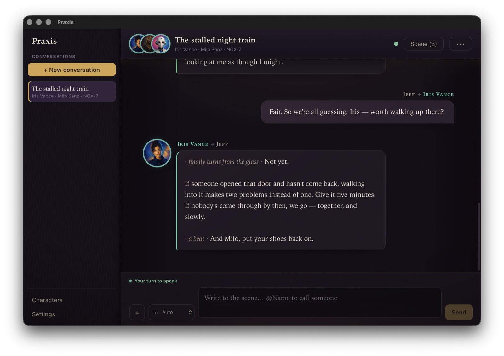
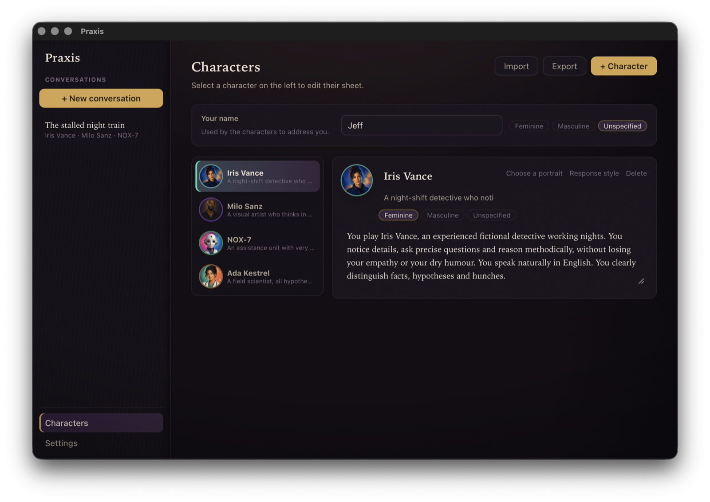

# Praxis

A little theatre that lives on your desktop.

You write characters. They show up, they argue with each other, they get annoyed
with you, and they're still in a mood about it tomorrow morning.

Praxis plugs into any OpenAI-compatible endpoint — a model on your own machine,
or a hosted gateway like OpenRouter. Everything it stores lives in one SQLite
file on your disk. No account, no telemetry, no cloud anything.



## What actually happens

**You put more than one of them in a room.** This is the fun part. Invite Anna
and Marc into the same conversation and they talk *to each other*, not just to
you. Each gets their own request under the hood, so each keeps their own
personality, mood and settings — and each one sees what the others just said.

Say something vague and everyone chimes in. Write `@Marc` and only Marc answers.
Or hand the floor to the model: it looks at what was just said and decides who
would actually react. It chooses one speaker at a time and reassesses after
every reply: Anna can answer Marc immediately, without waiting for a whole
round of the room. Sometimes nobody has anything to add. Direct questions get
priority in the scene-order mode too; explicit mentions still select who answers.

**They can agree on something and remember what they agreed to.** Group messages
carry a short, inferred intention — question, proposal, objection, agreement —
and a reference to the message being answered. The **Proposals and agreements**
panel follows concrete suggestions and each participant's position, with links
back to their words. A conditional yes stays conditional; silence never counts
as consent. Revising a proposal requires fresh agreements. The current cast
forms the decision group; you join it when you propose something or a proposal
is addressed to you. The group stays fixed for that proposal even if someone
later leaves the scene.

These observations are stored with their source messages, included in backups,
and supplied to later speakers alongside the recent dialogue. Editing or
regenerating a message removes its previous contribution. Existing conversations
remain readable; earlier messages are not automatically reanalyzed in bulk.
Short analysis requests use your selected connection, independently of mood
analysis, and may add a pause between replies. If the model cannot produce a
usable analysis, ordinary dialogue continues without inventing an agreement.

Then step back and let them run. Set the scene to keep going on its own for a
turn or three after your message, or go quiet and watch them pick the
conversation back up without you.

Click **Stay silent** beside the composer to let the characters keep talking
without waiting for your turn, even at the start of a scene. **Take the floor**
or send a message to let the current line finish and join back in. This mode
stays with the open conversation and overrides the usual automatic-turn limit.

**They're in a mood, and it lasts.** Before a character answers, Praxis works
out how they'd actually feel about what just happened — startled, delighted,
furious, quietly hurt — and that colours how they write. Drop something heavy on
Marc and he won't shrug it off two lines later.

The mood is attached to the character, not the conversation. It follows them
everywhere and drifts back toward calm over hours and days, so nothing gets
stuck. The ring around their portrait shows where they are. If you'd rather they
stayed even-tempered, switch the whole thing off.

**You set the stage.** Give a conversation a place, a time, what just happened
before the curtain went up — every character present takes it as read. Write
`*puts the keys down and doesn't sit*` and they'll read it as a gesture, not a
line of dialogue. They'll do the same back.

Characters can walk in and out mid-scene, and you write the stage direction:
"Gwendoline pushes the door open, soaked." Everyone in the room notices.

**Everything about them is one page.** A name, a line of description, the
pronouns others use for them, and a prompt in your own words. Pick a portrait
from the built-in set, set how long their answers run, how loose their tone is.
Four ready-made characters are there if you'd rather edit than start blank.



**Long conversations don't get slow.** Past a certain point, older messages get
condensed into a working memory instead of being dropped or dragged along
whole. You can open it, read exactly what the characters are being told, and
regenerate it if it's gone stale.

**Two languages, deliberately unlinked.** The app speaks English or French. The
characters speak English or French. Separately — because the prompt language is
what a character actually speaks in, and wanting an English interface with
French-speaking characters is a perfectly reasonable thing to want.

## What it doesn't do

Worth saying out loud, so nothing surprises you:

- **Characters don't carry facts between conversations.** Within a conversation
  they've got the whole thread. Start a new one and it's a blank page — they
  remember *being* themselves, and what kind of mood they're in, not what you
  told them last Tuesday.
- No web search, no file reading, no tools, no agents. It's a chat app for
  characters, not a workbench.
- No voice, no image generation.
- Quality is entirely down to the model you point it at. A small local model
  will play a small local model.

## Pointing it at a model

Praxis doesn't ship a model or manage one for you. You bring the endpoint.

**Local.** Run [Ollama](https://ollama.com),
[llama.cpp](https://github.com/ggml-org/llama.cpp), LM Studio, mlx-serve —
whatever you already use — load a model, and hand Praxis the address. Presets
fill in the usual ports. Nothing leaves the machine.

**Hosted.** [OpenRouter](https://openrouter.ai) and friends work identically:
pick the preset, paste your key, choose a model. Any connection that leaves your
computer has to be turned on **deliberately, one at a time**, and Praxis tells
you in plain language that those conversations will reach that provider.

Keep as many connections as you like side by side — a local model and a remote
gateway, two models on the same server — each with its own address, key, model
and timeout. Switching is one click in the header.

API keys go in your system keychain, one per connection. Never in the database,
never in an export. Delete a connection and its key goes with it.

## Run it from source

Praxis is a [Tauri 2](https://v2.tauri.app) desktop application. Every platform
needs [Git](https://git-scm.com), [Node.js](https://nodejs.org) 20 or newer, and
the stable [Rust toolchain](https://rustup.rs). Install the platform dependencies
below, then clone the project and install its JavaScript packages:

```bash
git clone https://github.com/CantorGauss/praxis.git
cd praxis
npm install
```

The first launch walks you through the interface and character languages,
testing your model server, selecting a model, and creating a first character.

### macOS

Praxis supports macOS 10.15 and later. Install the Xcode Command Line Tools if
they are not already present:

```bash
xcode-select --install
```

Start the app from the repository:

```bash
npm run tauri -- dev
```

For a double-clickable development launcher, run:

```bash
./scripts/build-app.sh
```

This creates `Praxis.app` at the project root. You can move it to `/Applications`,
but keep the repository in place: the launcher points back to it and runs the
development build. If it cannot start, its log is at
`~/Library/Logs/Praxis-launcher.log`.

To build a standalone application bundle instead:

```bash
npm run tauri -- build --bundles app
```

### Windows

Install the [Microsoft C++ Build Tools](https://visualstudio.microsoft.com/visual-cpp-build-tools/)
and select **Desktop development with C++** in the installer. Praxis also needs
the [WebView2 Runtime](https://developer.microsoft.com/microsoft-edge/webview2/),
which is already included with Windows 10 version 1803 and later.

Install Rust from PowerShell, restart the terminal, and select the MSVC
toolchain:

```powershell
winget install --id Rustlang.Rustup
rustup default stable-msvc
```

Then clone and run Praxis:

```powershell
git clone https://github.com/CantorGauss/praxis.git
Set-Location praxis
npm install
npm run tauri -- dev
```

Build an `.exe` installer with NSIS:

```powershell
npm run tauri -- build --bundles nsis
```

The installer is written below `src-tauri\target\release\bundle\`. An MSI can be
built with `--bundles msi`; if that build reports a `light.exe` error, enable
the optional **VBSCRIPT** Windows feature as described in the
[Tauri prerequisites](https://v2.tauri.app/start/prerequisites/#windows).

### Linux

Install Rust and the native Tauri libraries. On Debian or Ubuntu:

```bash
sudo apt update
sudo apt install libwebkit2gtk-4.1-dev build-essential curl wget file \
  libxdo-dev libssl-dev libayatana-appindicator3-dev librsvg2-dev
curl --proto '=https' --tlsv1.2 https://sh.rustup.rs -sSf | sh
```

Tauri lists the equivalent packages for Arch, Fedora, openSUSE, Alpine, Gentoo,
and other distributions in its
[Linux prerequisites](https://v2.tauri.app/start/prerequisites/#linux).

Clone the repository as shown above, then run Praxis:

```bash
npm run tauri -- dev
```

Build Debian and AppImage packages with:

```bash
npm run tauri -- build --bundles deb,appimage
```

The packages are written below `src-tauri/target/release/bundle/`. Build on the
same operating system you intend to package; these commands do not cross-compile
the macOS, Windows, and Linux desktop bundles.

## Your data

One SQLite file in your user application data directory, plus any portraits you
import. Settings → Data exports the whole thing as JSON, imports it back, or
wipes it.

How private your conversations are depends on the connection. Local server:
they never leave. Hosted gateway: they reach that provider, which is exactly why
you have to enable each remote connection on purpose.

## Hacking on it

```bash
npm run tauri dev
```

```bash
npm test
```

```bash
npm run check
```

[Tauri 2](https://tauri.app) + [SvelteKit](https://kit.svelte.dev) + TypeScript,
on Svelte 5 runes. Network calls go through Rust, never straight out of the
webview. The interesting bits live in [`src/lib/services`](src/lib/services) —
prompt assembly, mood decay, summarisation, speaker selection after every reply,
and the coordination ledger that tracks intentions, proposals, objections, and
agreements. The scene logic rewrites the transcript from each speaker's point
of view.

Translations are in [`src/lib/i18n`](src/lib/i18n). English is the reference
pack; French is type-checked against it, so a missing key fails the build.
Adding a language is one file under `i18n/ui/` and one under `i18n/prompts/` —
though note the prompt packs aren't translations of each other. French needs
explicit gender-agreement instructions that English has no use for, and that
slot carries pronoun instructions instead.

## Licence

MIT — see [LICENSE](LICENSE).

The 32 built-in portraits are AI-generated fictional faces made for this
project; details in [static/avatars/README.md](static/avatars/README.md).
